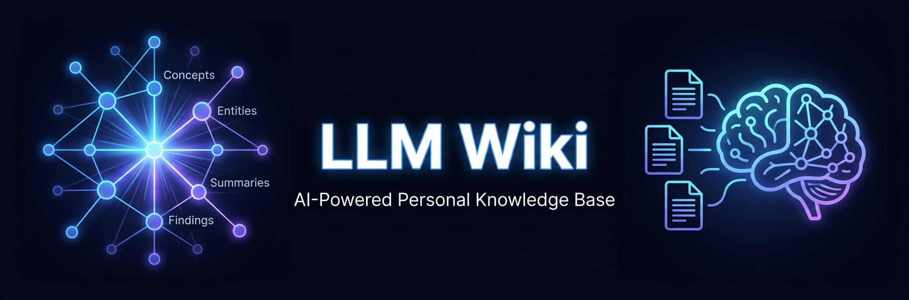
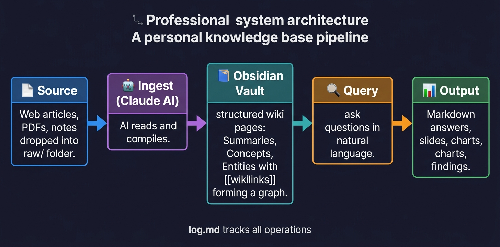
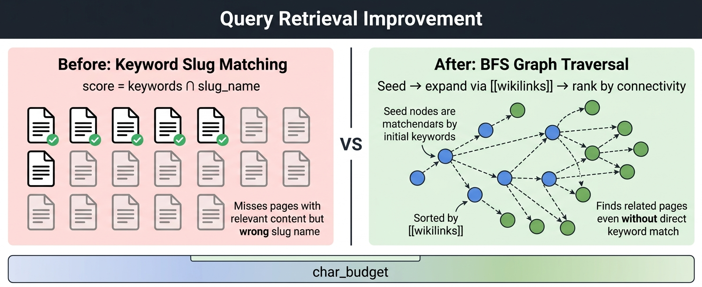

# LLM Wiki

> **AI가 관리하는 나만의 지식 베이스** — 자료를 넣으면 AI가 정리하고, 질문하면 AI가 wiki를 탐색해 답합니다.

[Andrej Karpathy의 LLM Knowledge Base 패턴](https://gist.github.com/karpathy/442a6bf555914893e9891c11519de94f) 구현체.

---

## 이게 뭔가요?

웹 아티클, 논문, 메모를 `raw/` 폴더에 던져 넣으면:

1. **Claude AI**가 자동으로 읽고 → 개념 정리, 인물/도구 페이지, 요약을 Obsidian vault에 생성
2. **Obsidian**에서 지식 그래프로 시각화
3. **자연어로 질문**하면 wiki를 탐색해 답변 + 슬라이드/차트 자동 생성

사람은 자료를 넣고 질문만 하면 됩니다. 나머지는 AI가 씁니다.

---

## 작동 방식



| 단계 | 내용 |
|------|------|
| **소스 투입** | Web Clipper, 복붙, last30days 트렌드 수집으로 `raw/`에 마크다운 저장 |
| **AI 컴파일** | Claude가 소스를 읽고 개념·인물·요약 페이지를 자동 생성 + `[[wikilink]]`로 연결 |
| **Obsidian** | Graph View로 지식 그래프 탐색, Marp 슬라이드 미리보기 |
| **Query** | 자연어 질문 → wiki 탐색 → 마크다운/슬라이드/차트 출력 |
| **Findings** | 가치 있는 답변은 `wiki/findings/`에 자동 파일링 |

---

## 빠른 시작

### 1. 설치

**필요 조건**: Python 3.10+, [Claude Code CLI](https://claude.ai/code), [Obsidian](https://obsidian.md)

```bash
git clone <repo-url> && cd llm-wiki
python3 -m venv .venv && source .venv/bin/activate
pip install -r requirements.txt
chmod +x wiki
python3 scripts/setup.py   # vault 경로 설정 + 디렉토리 생성
```

전역 명령으로 등록하면 어디서든 `wiki` 명령으로 실행 가능합니다:

```bash
echo 'alias wiki="/path/to/llm-wiki/wiki"' >> ~/.zshrc && source ~/.zshrc
```

### 2. Obsidian vault 설정

```bash
bash scripts/setup_vault.sh        # vault 디렉토리 초기화
```

Obsidian 앱 → **Open folder as vault** → `obsidian-vault/llm-wiki/` 선택

`config.yaml`에서 경로 확인:
```yaml
vault_path: /Users/<your-name>/path/to/obsidian-vault/llm-wiki
```

### 3. 첫 번째 ingest

```bash
# 아무 마크다운 파일을 raw/에 넣고
./wiki ingest

# 결과 확인
./wiki status
```

---

## 사용법

### ingest — 소스 → wiki

```bash
./wiki ingest                       # raw/ 미처리 파일 전체 (기본값)
./wiki ingest raw/article.md        # 단일 파일
./wiki watch                        # raw/ 감시 (자동 ingest)
```

소스 1개당 생성되는 페이지:
- `wiki/summaries/` — 소스 요약
- `wiki/concepts/` — 언급된 개념 아티클
- `wiki/entities/` — 인물·도구·조직

### query — 질문하기

```bash
./wiki query "트랜스포머 어텐션이 왜 O(n²)인가?"
./wiki query "이 개념들 비교해줘" --slides       # Marp 슬라이드
./wiki query "관계도 그려줘" --diagram           # Mermaid 다이어그램
./wiki query "분포 보여줘" --chart               # matplotlib PNG
./wiki query "설계 정리해줘" --diagram --archive # 결과를 wiki에 자동 편입
```

### lint — wiki 건강 검사

```bash
./wiki lint          # dead links, orphans, index 불일치 탐지
./wiki lint --fix    # 자동 수정 가능한 항목 수정
./wiki lint --deep   # LLM으로 모순 탐지 (느림)
```

---

## Query 개선: BFS 그래프 탐색



기존 방식은 질문 키워드와 **slug 이름**만 비교했습니다.
`"트랜스포머 어텐션"` 질문에 `attention-is-all-you-need` 페이지가 매칭 안 되는 상황이 발생했죠.

**개선된 3단계 전략**:

1. **키워드 매칭** — slug 이름으로 시드 10개 선택
2. **BFS 1홉 확장** — 시드 페이지의 `[[wikilinks]]`를 따라 이웃 페이지 추가
3. **연결도 정렬** — wikilink가 많은 핵심 허브 페이지 우선, 토큰 예산(18,000자) 내 포함

wiki가 50페이지를 넘어갈수록 효과가 체감됩니다.

---

## 트렌드 자동 수집

[last30days](https://github.com/mvanhorn/last30days-skill) 스킬로 Reddit, X/Twitter, Hacker News 최근 30일 트렌드를 수집해 wiki로 인제스트합니다.

```bash
# Claude Code 세션에서
/last30days LLM 최신 트렌드 --deep

# 터미널에서 vault 인제스트
bash scripts/ingest_trends.sh
bash scripts/ingest_trends.sh --all        # 오늘 생성 전체
bash scripts/ingest_trends.sh --copy-only  # 복사만
```

> **팁**: last30days 결과를 그대로 넣지 말고, 핵심 3~5개 항목만 남기고 정리 후 ingest하세요.

---

## 운영 철학: 깊이 우선

> **많이 넣는 게 아니라 잘 넣는 게 목적입니다.**

### wiki 규모별 체감 품질

| 규모 | 체감 |
|------|------|
| ~50페이지 | slug 매칭 한계 거의 없음 |
| 50~150페이지 | query miss 가끔 발생 |
| 150페이지+ | BFS 개선 효과 뚜렷 |

### 소스 품질 기준

**넣어야 할 것**: 논문, 공식 문서, 심층 분석, 반복 참조하는 자료

**넣지 말아야 할 것**: 단순 뉴스, 요약만 있는 슬라이드, "언젠간 읽겠지" 자료

### 핵심 습관

```bash
# 1. 자료 넣은 직후 바로 query
./wiki query "방금 읽은 자료의 핵심을 기존 지식과 비교해줘"

# 2. 2주에 1번 lint
./wiki lint --fix

# 3. 도메인 3개에 집중 (넓게 말고 깊게)
```

---

## Obsidian 플러그인

| 플러그인 | 용도 | 설치 |
|---------|------|------|
| [Web Clipper](https://obsidian.md/clipper) | 웹 페이지 → `raw/` 저장 (브라우저 확장) | Chrome/Firefox 확장 |
| Marp Slides | `--slides` 결과 미리보기 | Community Plugins 검색 |

Web Clipper 설정: Vault → `llm-wiki`, Default location → `raw/`

---

## Discord 봇 연동

Discord에서 `!query`, `!ingest`, `!status` 명령으로 wiki를 사용할 수 있습니다.

### 설정

1. [Discord Developer Portal](https://discord.com/developers/applications)에서 Bot 생성
2. Bot Token 복사 → `.env` 파일에 저장:

```bash
cp .env.example .env
# .env 편집: DISCORD_TOKEN=your_token_here
```

3. Bot을 서버에 초대 (OAuth2 → bot scope → Send Messages, Attach Files 권한)

### 실행

```bash
./wiki discord
```

### 명령어

| 명령어 | 설명 |
|--------|------|
| `!query <질문>` | wiki 탐색 후 답변 |
| `!query <질문> --diagram` | Mermaid 다이어그램 |
| `!query <질문> --chart` | 차트 PNG 이미지 전송 |
| `!query <질문> --archive` | 결과를 wiki에 자동 편입 |
| `!ingest` | raw/ 미처리 파일 전체 ingest |
| `!status` | wiki 현황 요약 |

특정 채널에서만 동작하게 하려면 `.env`에 `DISCORD_CHANNEL_IDS=채널ID` 추가.

---

## macOS 자동 실행 (launchd)

로그인 시 `raw/` 감시가 자동 시작됩니다:

```bash
bash scripts/setup_launchd.sh           # 등록
tail -f /tmp/llm-wiki-watch.log         # 로그 확인
bash scripts/setup_launchd.sh --remove  # 해제
```

---

## 개선 로드맵

현재 query.py BFS 1홉 확장이 구현되어 있으며, 다음 단계가 계획되어 있습니다:

| 버전 | 내용 | 상태 |
|------|------|------|
| v1 | BFS 1홉 확장 + 연결도 정렬 + 토큰 예산 | ✅ 완료 |
| v2 | Full-text 본문 스캔으로 slug 매칭 교체 (slug 3x + 본문 빈도 1x) | ✅ 완료 |

---

## Phase 현황

| Phase | 내용 | 상태 |
|-------|------|------|
| 1 | 디렉토리 구조, AGENTS.md, vault 네임스페이스 | ✅ |
| 2 | Ingest 파이프라인 | ✅ |
| 3 | Query 엔진 (text/slides/diagram/chart) | ✅ |
| 4 | Lint (dead links, orphans, 모순 탐지) | ✅ |
| 5 | CLI, 설정, 플러그인 가이드 | ✅ |
| 6 | BFS 컨텍스트 확장 + 토큰 예산 | ✅ |

---

## 참고

- [Karpathy 원문 Gist](https://gist.github.com/karpathy/442a6bf555914893e9891c11519de94f)
- [AGENTS.md](./AGENTS.md) — wiki 스키마 & LLM 운영 규칙
- [CLAUDE.md](./CLAUDE.md) — Claude Code 세션 가이드
- [config.yaml](./config.yaml) — 경로·설정
